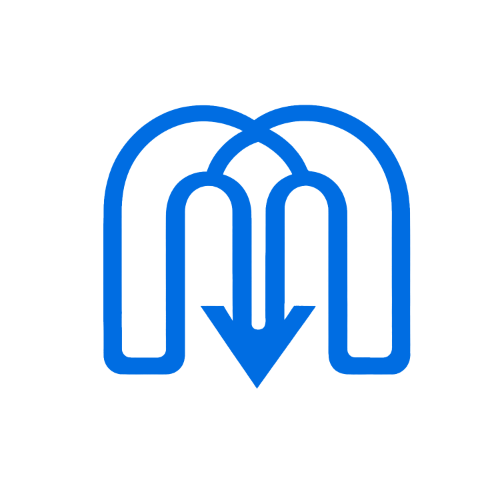

# mmdl

An extension for Chromium-based browsers that allows you to download videos from MyMedia.

## Disclaimer

**mmdl** is not affiliated with or endorsed by the University of Toronto, or MyMedia. It is an independent project that aims to provide a better user experience for students. Furthermore, **mmdl** does not provide access to content that is not publicly available, nor does it redistribute copyrighted material.

## About

More often than not, content that's uploaded to MyMedia has the download option disabled. This prevents you from watching your course content offline or in the media player of your choice.

**mmdl** is a browser extension that helps you bypass this limitation and get through your content in the way that suits you best.

## Installation

1. Download an archive of this repository [here](https://github.com/ashenafee/mmdl/archive/refs/heads/main.zip).

2. Extract the archive to a folder of your choice.

3. Open your browser and navigate to `chrome://extensions/` (or `edge://extensions/` if you're using Microsoft Edge).

4. Enable Developer Mode.

5. Click on "Load Unpacked" and select the folder where you extracted the archive.

6. The extension should now be installed and ready to use.

## Usage

1. Open a tab with your MyMedia video.

2. Click on the **mmdl** icon in the browser toolbar.

3. Provide a name for the video file.

4. Select the video format you want to download.

    **Note:** This feature is still under development. For now, the only available format is MP4.

5. Click "Download".

## Frequently Asked Questions

### What is MyMedia?

MyMedia is a platform used by the University of Toronto to host course content. It is mainly used for uploading and viewing recorded lecture videos.

### Can I download **mmdl** from the Chrome Web Store?

No, **mmdl** is not available on the Chrome Web Store. You can only install it manually (see [Installation](#installation)). However, I plan to make it available on the Chrome Web Store in the future.

### Is **mmdl** safe to use?

Yes it is. **mmdl** does not collect any personal information or track your browsing activity. It only interacts with the MyMedia website to provide you with the download option.

If you would like to verify this, you can access the extension's source code through this repository.

## Contact

If you have any questions or concerns, feel free to contact me through  [LinkedIn](https://www.linkedin.com/in/ashenafee).

## License

**mmdl** is licensed under the MIT license. See the [LICENSE](LICENSE) file for more information.
